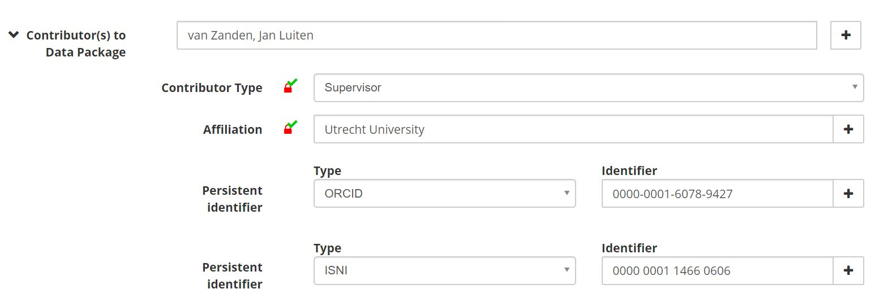

# Yoda Metadata 
## Introductory remarks on metadata

Metadata is 'data' about data  and serves multiple purposes, the most important being:

- To describe for a broad audience what is contained in a set of data.
- To inform the audience whether the data can be reused and if so, under what conditions. 

- To prescribe how the data should be cited and whom to acknowledge

- To inform digital archivists and IT on how long the data should be stored.

- Making discovery of the data possible in data catalogues 

In general metadata comes in two formats: in ‘structured’, ‘machine-readable’, format or in free format. 

**Structured** metadata in general consists of elements like name of the data package, the creator, the retention period of the package, the accessibility etc. 

When a data package is published, the structured metadata will be automatically exchanged with data catalogues providing them with a set of searchable values.

**Unstructured** metadata are meant for more detailed information on the data and the package, e.g. on the sampling method, experimental design, an in-depth description of archival holdings, data transformations etc. 

## Adding metadata in Yoda
In Yoda you can add both structured and unstructured metadata to your research data. 

**Unstructured** metadata can be added as a file to the collection of data-files, e.g. in the form of a Readme.txt or Codebook.pdf.

You can add **structured** metadata by navigating to the folder you want to add metadata to and press the button labeled *Metadata*.

Once you have added (some) metadata and clicked on the ‘Save’ button, your entries will be stored in a  file called yoda-metadata.xml, in that specific folder.

## The metadata form in the Yoda portal
The Yoda metadata form consists of app. 33 fields. Check [here](metadata-details.html) for a detailed description of each field.

All mandatory fields have a padlock-sign in front of them. 

Some metadata elements  are 'compound', i.e. they consist of more fields. E.g. if you fill out a person identifier, you should also specify the type of identifier.

Some (compound) elements are 'repeatable', i.e. they can be filled out multiple times. You create an extra field by pressing the '+' sign next to the field.

## Tips,tricks and remarks

- Please note that once you start [archiving](Archiving.html) your data a valid set of structured metadata is required before a data package can be archived.

- You can add one file with structured metadata per folder. Once you start archiving and/or publishing, the metadata file in the folder from which you start the archival process, is considered to be the structured metadata file describing the entire data package and which will be exchanged with the data catalogues of [DANS NARCIS](https://www.narcis.nl/?Language=nl) and [DataCite](https://search.datacite.org/).

- The structured metadata is reusable. Once you have saved a Yoda metadata form, the values you've entered are stored in a file yoda-metadata.xml. You can copy that file to other folders.  If you copy that file to another folder in your user-group and open the metadata form in that folder, you

- The specific set of structural metadata elements  you are offered in Yoda depends on your specific Yoda instance:  *Yoda for Geo* has other metadata fields than *Yoda for IOS*.

