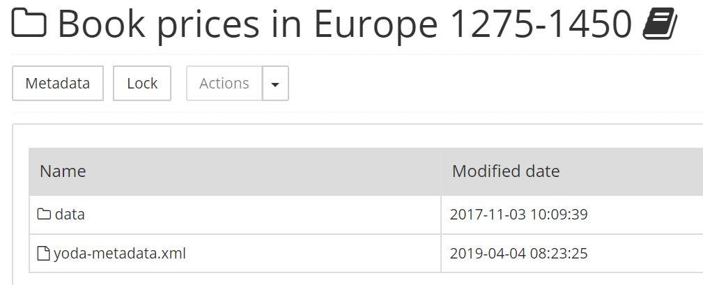

# Yoda Metadata 
## Introductory remarks on metadata

Metadata is 'data' about data  and serves multiple purposes, the most important being:

- To describe for a broad audience what is contained in a set of data.
- To inform the audience whether the data can be reused and if so, under what conditions. 

- To prescribe how the data should be cited and whom to acknowledge

- To inform digital archivists and IT on how long the data should be stored.

- Making discovery of the data possible in data catalogues 

Metadata can be in structured or unstructured format. 

**Structured** metadata consists of information that is standardized globally and used by data catalogs.
Examples are name of the data package, the creator, the retention period of the package, the accessibility etc. 

When a data package is published, Yoda makes the structured metadata available to data catalogs, thus providing them with a set of searchable values. 

**Unstructured** metadata are intended to privide more detailed information on the data. This information can be in a README.TXT or other file included as part of the data and the format is chosen by the researcher. Users will need to open and inspect the data package to find this metadata. 
Example information could entail the sampling method, experimental design, an in-depth description of archival holdings, data transformations etc. 

## Adding metadata in Yoda
In Yoda you can add both structured and unstructured metadata to your research data. 

**Unstructured** metadata can be added as a file to the collection of data-files, e.g. in the form of a Readme.txt or Codebook.pdf.

You can add **structured** metadata by navigating to the folder you want to add metadata to in the Yoda portal and press the button labeled *Metadata*.

Once you have added (some) metadata and clicked on the ‘Save’ button, your entries will be stored in a  file called yoda-metadata.xml, in that specific folder.

## The metadata form in the Yoda portal
The Yoda metadata form usually consists of approximately 30 fields. The fields may vary per group as per preference of the datamanager.  Check [here](metadata-details.html) for a detailed description of common fields.

All mandatory fields have a padlock-sign in front of them. 

Some metadata elements consist of multiple fields. E.g. if you fill out a person identifier, you should also specify the type of identifier.

Some fields are 'repeatable', i.e. they can be filled out multiple times. You create an extra field by pressing the '+' sign next to the field.

## Tips,tricks and remarks

- Please note that once you start [archiving](Archiving.html) your data a valid set of structured metadata is required before a data package can be archived.

- You can add one file with structured metadata per folder. Once you start archiving and/or publishing, the metadata file in the folder from which you start the archival process, is considered to be the structured metadata file describing the entire data package and which will be exchanged with data catalogs such as [DANS NARCIS](https://www.narcis.nl/?Language=nl) and [DataCite](https://search.datacite.org/).

- The structured metadata is reusable. A metadata form includes a button "Clone from parent folder" that can copy over metadata from the parent folder to save some time on data entry. A practice could be to create a project folder and underneath to create data folders.  At the project folder, add metadata and fill-in the fields taht are common for all data in  the project. Then at a data folder, clone the metadata from the project level as a starting point.    

- The structured metadata is stored in a file "yoda-metadata.xml".  You can copy this file to another folder to make a copy of the metadata. 

