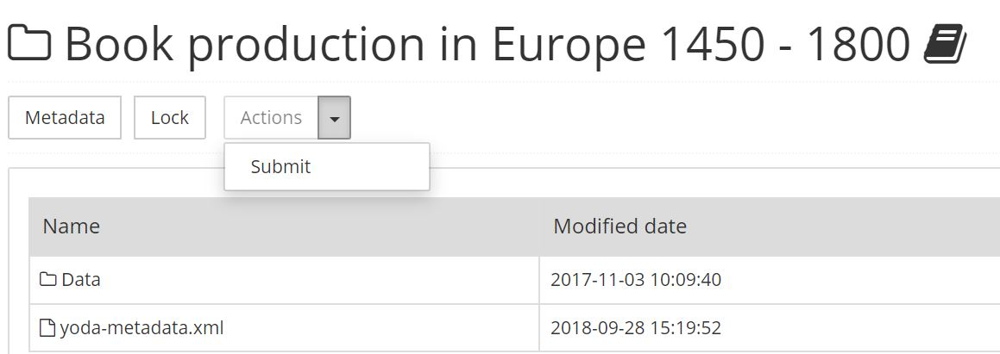

# Archiving your data
When archiving your data, you create a snapshot of a part of the data in your user-group and copy this snapshot to the archive (aka 'Vault') of your user-group, where it will be retained unchanged for the period you indicate. 

After archiving your data, you can publish it, making your data findable and, depending on your settings, accessible.

On this page you get an explanation on:

- How to submit your data as an archival data package
- The difference between your data and an archival data package.
- The checks carries out on your submitted data package, before it is accepted to the archive.
- How to access your archived data package.
- How your data will be managed in the archival storage of Yoda.

## Submitting data to a Yoda archive
To create an archival package in the Yoda portal, navigate to the folder you want to archive and press the <Actions (Submit)> button. 

   

Before sending your data as a data package to the Vault, ensure that:

1. You have the appropriate rights, either group manager or read/write permissions.

2. You are **in** the folder of which you want archive (incl. its sub-folders).

3. The folder has a file containing all mandatory Yoda metadata. If this is not the case the system will tell you what metadata is missing and allows you to edit the metadataform (button <Metadata>)
4. The folder is not locked (check the button <(Un)lock> or press the exclamation mark next to the folder name, to identify the location of the lock in the folder tree.)

 When you start the archival process, the system will automatically

- Check whether there is a valid metadata file available in the folder where you started your submission

- Lock the folder and its sub-folders (note: during the archiving process, data can no longer be added, deleted or updated; once the data is copied to the vault, the lock will be removed).
- Notify the data manager that a new data package is waiting for assessment - after his approval, the data will be archived.

## Creating a data-package
The data in your research-group is ‘just’ a bunch of files and folders of which only you and your co-workers in your user-group know what they mean and how they relate.

When you archive data, you need to make it into a ‘comprehensible’ package, so that once you publish your archival package, colleague researchers can understand what the data is about, how it was collected/generated and how and under what conditions it can be (re)used. 

You do this by ensuring a proper folder structure, filling in the Yoda-metadata form, and providing readme.txt and/or codebook files that describe your data in more detail.

## Checks before archiving
When you start the archival process, the system will automatically check for a valid metadata file.

After that the data manager manually assesses the data-package as well.  If he finds unclarities in the description, he can ask for changes to the folder structure or data-package description before he accepts the package for archival.

The basic idea behind this assessment is that

- the data packages are self-evident for other researchers
- meet basic standards of quality
- comply to sensitive data and privacy rules and regulations.

This assessment consists of a number of checks. This list provides you with an overview of the [checks](DM-checks.html).

## Access to your archived data
The vault of your user-group becomes visible once it contains at least one data package. Everyone with access to your user-group also has (read-only) access to the vault of your user-group.

If the user-group no longer exists you can request access to the data-package via the data manager, or, if the data-package has been published as _Open Access_, it can be retrieved via Data Catalogues, e.g. that of [Dans Narcis](https://www.narcis.nl/?Language=nl) or [DataCite](https://search.datacite.org/)

## Maintenance of an archived data package
Once your data has been secured in the Yoda Vault, it will remain there for the time you have indicated in the metadata. 

During this retention time the data files will be checked regularly for [data-rot](https://en.wikipedia.org/wiki/Data_degradation). Affected files will be replaced with a back-up.

Please note that Yoda does not provide for data sustainability; files associated with a specific software version will not be automatically migrated to the latest version. E.g. when in a new version Microsoft Word comes out, requiring documents created with older version to be migrated, Yoda will **not** automatically converse all the older word files in its archival storage.

To prevent data-loss caused by the changing of file formats, you'd best store your data in open formats. For an overview of options, please check the list of preferred file formats of [DANS](https://dans.knaw.nl/en/about/services/easy/information-about-depositing-data/before-depositing/file-formats).