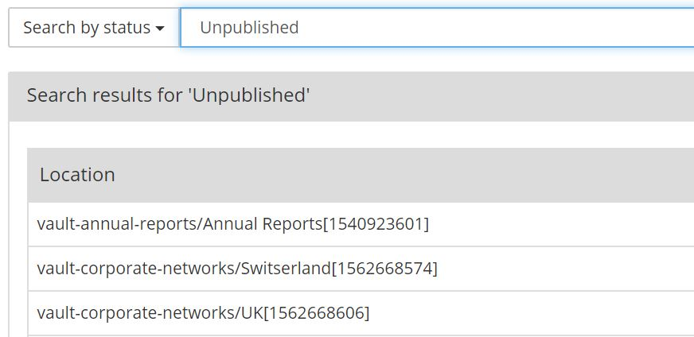

# Publishing your Data Package
Having archived your data as a data package, you have made it into a ‘comprehensible’ data package. You can now choose to publish your data.

By publishing your data:

- Your data package will get a [DOI](https://www.doi.org/) assigned to it, a persistent identifier you can use as a reference to your data, e.g. in a scientific publication.
- The metadata description of your data will be included in data catalogs such as [Dans NARCIS](https://www.narcis.nl/?Language=nl) or [DataCite](https://search.datacite.org/).

**Take Note:**
*By 'publishing' your data package, you're actually making the Yoda metadata of your data package publicly accessible,* **not** *the data itself. The metadata, which you have created by filling in the metadata form in the Yoda Portal, will be included and can be found in data catalogs such as mentioned above.*

*Optionally the data itself can be set to be downloadable via the internet as well. To do so, specify in the metadata field Access Type the value "Open - Freely retrievable".  Other access type value (Restricted, Closed) are possible, in that case the data itself is not downloadable.*

## Publishing your Data Package
You can only publish archived data packages. You do so by opening the *Yoda Portal,* navigate to a data package in your vault and press the <Publish> button.

Yoda users can also opt to find data that is archived but not (or not yet) published. This is performed in the Yoda portal using the search-by-status function. 
Note that the list of data packages found will be include only the data packages residing in data compartments of which you are a member.
By clicking on one of the results, you automatically navigate to that particular data packages.

Once you’ve published a data package the data manager is notified and will checks whether:

- A valid *License type* has been defined in the metadata of the data package.

- The *Access Type*  in the metadata of the data package is in line with rules and regulations with regards to sensitive and private data

If the data manager finds anything missing, he/she will contact you. Otherwise you'll receive a notification per mail containing your DOI.

