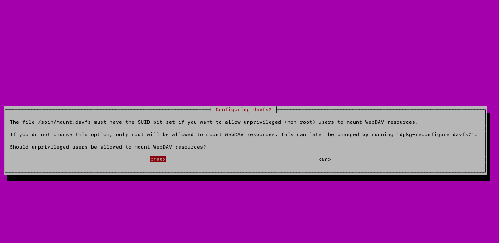

# Connecting to the Yoda Network Disk using davfs2

This page describes how to connect to the Yoda Network Disk on a Linux system using davfs2. It assumes familiarity
with using commandline tools. The instructions are suitable for RedHat-based distributions (e.g. Fedora or CentOS) and for
Debian-based distributions (e.g. Ubuntu).

## Installing the package

Install the davfs2 package.

For Debian/Ubuntu:
- _sudo apt -y install davfs2_ 
- Confirm that unprivileged users should be able to mount davfs2 volumes (&ldquo;Yes&rdquo;).

For RedHat/CentOS/Fedora:
- _sudo yum -y install epel-release_
- _sudo yum -y install davfs2_

## Configuring group membership

Look up your user name, uid and gid using the &ldquo;id&rdquo; command.

Add your user account to the davfs2 group: _sudo usermod -aG davfs2 user_ (replace &ldquo;user&rdquo; with your user name).

Close the terminal window and open a new one to activate the group change.

## Configuring Davfs2

Open the davfs2 configfile in a text editor (e.g. _sudo vi /etc/davfs2/davfs2.conf_). Ensure
parameter *delay_upload* is set to 0 (zero). This limits the risk of data loss from a failure to flush data after
large file transfers.

Look up the Yoda Network Disk URL of your Yoda Environment (see table below).

| Environment          | Server address | Remarks                  |   
|:-------------------- |:------------|:-------------------------|
| Dynamics of Youth    | https://youth.data.uu.nl | | 
| Faculty of Geosciences | https://geo.data.uu.nl | | 
| Faculty of Humanities  | https://gw.data.uu.nl | Humanities researchers often use the _Institutions for Open Societies_ environment rather than this faculty environment. |
| Faculty of Law, Economics and Governance | https://i-lab.data.uu.nl | |
| Faculty of Medicine    | https://dgk.data.uu.nl | |
| Faculty of Science     | https://science.data.uu.nl | |
| Faculty of Social and Behavioural Sciences | https://fsw.data.uu.nl | |
| Faculty of Veterinary Medicine | https://dgk.data.uu.nl | |
| Institutions for Open Societies | https://i-lab.data.uu.nl | |
| University Corporate Offices    | https://its.data.uu.nl   | | 
| SCOOP Consortium | https://scoop-disk.data.rug.nl | |

Open the /etc/fstab file in a text editor (e.g. _sudo vi /etc/fstab_) and add a configuration
line for the Yoda Network Disk:

_https://mydepartment.data.uu.nl  /mnt davfs user,auto,uid=1000,gid=1000 0 0_

And adjust the parameters as needed:
- Replace _https://mydepartment.data.uu.nl_ with the URL of your Yoda Network Disk
- If you'd like to mount the Yoda Network Disk in a different location, replace _/mnt_ with a different local directory.
- Replace the _uid_ and _gid_ parameters with your uid and gid, as shown by the _id_ command.
- If you don't want the Yoda Network Disk to be mounted automatically after your system starts, remove "auto," from the options.

Now use a text editor to create a secrets file, which contains your Yoda Network Disk URL, Yoda user name and password, separated by spaces.
If you are an employee or student at Utrecht University, your user name is your Utrecht University email address (in lowercase) and your password
is your Solis password. External users have usually received their user name via email, along with a link to set their password. 
Example of a secrets file: &ldquo;https://mydepartment.data.uu.nl j.jansen@uu.nl mySecretPassword&rdquo;. You need
to escape any backslashes and double quotes in your password with a backslash (e.g. use &ldquo;\\\\&rdquo; instead of &ldquo;\&rdquo;).

Install this secrets file as the global davfs2 secrets file:
- _sudo install -m 0600 -o root -g root secrets /etc/davfs2/secrets_
- _rm secrets_

## Mounting the Yoda Network Disk

The disk should automatically if you have configured the &ldquo;auto&rdquo; option in /etc/fstab

To manually mount the Yoda Network Disk:
- On Debian/Ubuntu: _mount /mnt_
- On RedHat/CentOS/Fedora: _sudo mount /mnt_ (you can ignore any warnings about writing to the mtab file)

## Acknowledgements

Thanks to [Joost de Graaf](https://www.uu.nl/medewerkers/JdeGraaf) for his contributions to this guide.
