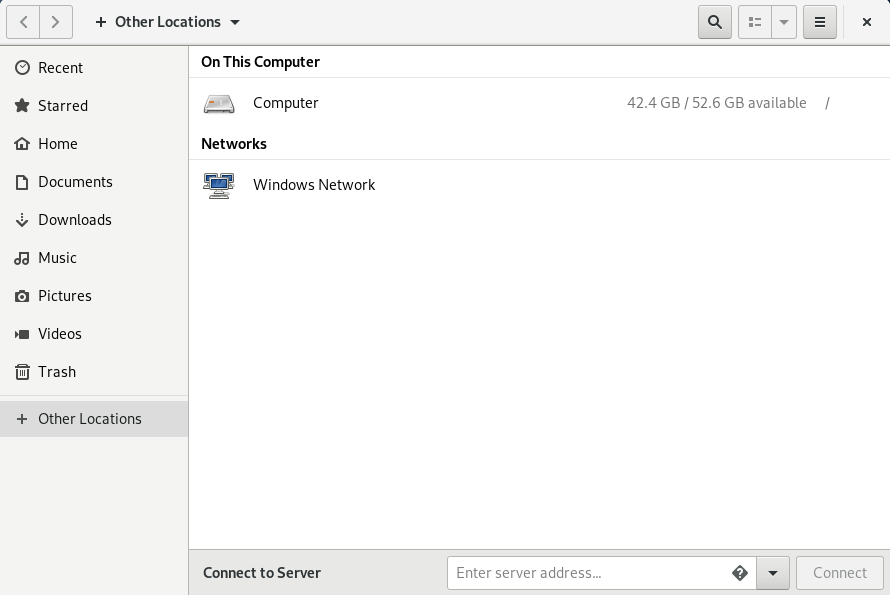

# Connecting to the Yoda Network Disk using GNOME files

GNOME users can connect to the Yoda Network Disk with GNOME Files (also known as Nautilus in older versions of GNOME).

Click on "+Other Locations" and enter the server address in the "Connect to Server" bar. You can look up the server
address of your Yoda environment in the table below.

| Environment          | Server address | Remarks                  |
|:-------------------- |:------------|:-------------------------|
| Dynamics of Youth    | davs://youth.data.uu.nl | |
| Faculty of Geosciences | davs://geo.data.uu.nl | |
| Faculty of Humanities  | davs://gw.data.uu.nl | Humanities researchers often use the _Institutions for Open Societies_ environment rather than this faculty environment. |
| Faculty of Law, Economics and Governance | davs://i-lab.data.uu.nl | |
| Faculty of Medicine    | davs://dgk.data.uu.nl | |
| Faculty of Science     | davs://science.data.uu.nl | |
| Faculty of Social and Behavioural Sciences | davs://fsw.data.uu.nl | |
| Faculty of Veterinary Medicine | davs://dgk.data.uu.nl | |
| Institutions for Open Societies | davs://i-lab.data.uu.nl | |
| University Corporate Offices    | davs://its.data.uu.nl  | |
| SCOOP Consortium | davs://scoop-disk.data.rug.nl | |

Then click on the Connect button.

You will be prompted for a name and password.
If you are an employee or student at Utrecht University, your user name is your Utrecht University email address (in lowercase) and your password
is your Solis password.  External users have usually received their user name via email, along with a link to set their password.
