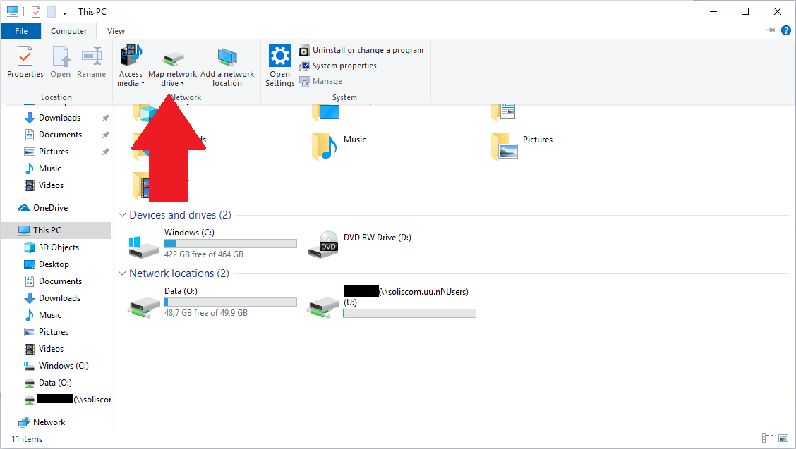
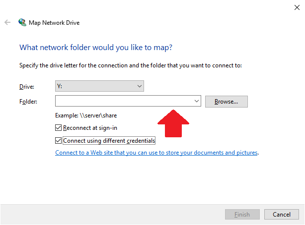
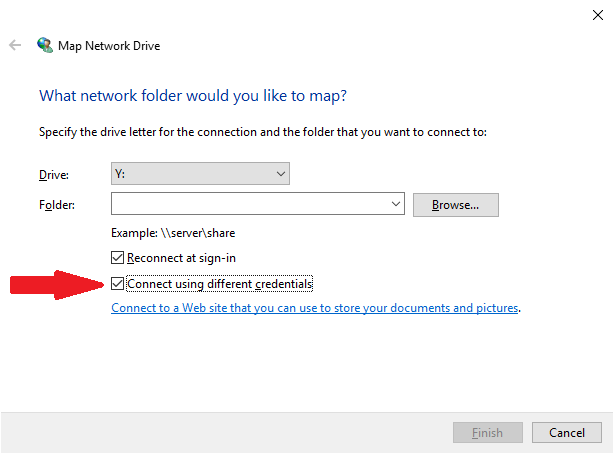
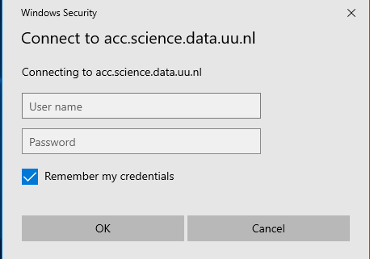
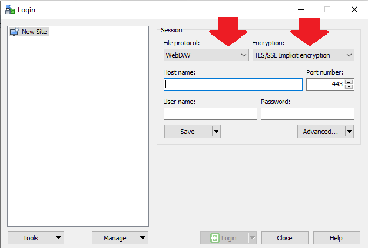
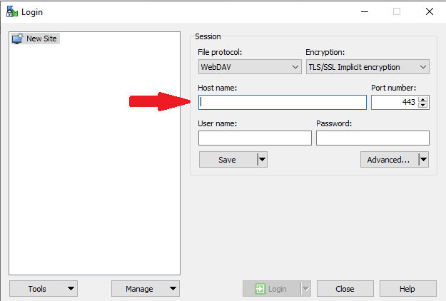
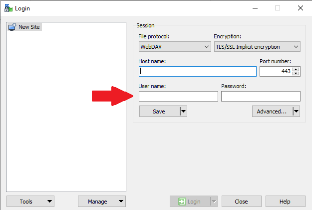

# Connecting to the Yoda Network Disk on Windows

Look up the server address of your environment:

| Environment          | Server address | Remarks                  |
|:-------------------- |:------------|:-------------------------|
| Dynamics of Youth    | https://youth.data.uu.nl | |
| Faculty of Geosciences | https://geo.data.uu.nl | |
| Faculty of Humanities  | https://gw.data.uu.nl | Humanities researchers often use the _Institutions for Open Societies_ environment rather than this faculty environment. |
| Faculty of Law, Economics and Governance | https://i-lab.data.uu.nl | |
| Faculty of Medicine    | https://dgk.data.uu.nl | |
| Faculty of Science     | https://science.data.uu.nl | |
| Faculty of Social and Behavioural Sciences | https://fsw.data.uu.nl | |
| Faculty of Veterinary Medicine | https://dgk.data.uu.nl | |
| Institutions for Open Societies | https://i-lab.data.uu.nl | |
| University Corporate Offices    | https://its.data.uu.nl   | |

## Mapping network drive

Open "This PC" from the Start menu

Open the Computer menu item and select "Map network drive". 

 
Select a drive letter - any free letter is okay. Now enter the server address of the environment in the Folder field (see table above).

Ensure the box "Connect using different credentials" is checked and click on the Finish button. 

 
Enter your user name and password. If you are working on your personal PC or laptop, tick the checkbox "Remember my credentials". If you are working on a shared computer,
it is better not to tick this checkbox for security reasons. Click on the "OK" button.

 
The Explorer screen will show the folders you have access rights to. You
can now drag and drop your files to upload or download them.

## Alternative: use WinSCP

If you experience problems with accessing data using a mapped network drive, you can alternatively
use a different client program for accessing data in Yoda, such as [WinSCP](https://winscp.net).

First install WinSCP according to the [WinSCP install guide](https://winscp.net/eng/docs/guide_install).

Start WinSCP from the Desktop icon or the Start menu.

In the login window, ensure that the file protocol is set to "WebDAV" and encryption is set to "TLS/SSL implicit encryption".

Enter the server address of your environment (see table above) in the Host name field. The port number should have its default value: 443.

Enter your user name and password. 

Click on the Save button and then on the Login button. WinSCP should now open your Yoda Network Disk.
