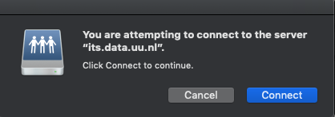
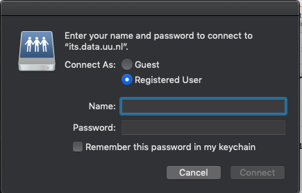

# Connecting to the Yoda Network Disk on MacOS

You can open the Yoda Network Disk using the Finder app. By default, the Finder icon is shown in the bottom left corner of your screen, in the Dock. Click on this icon. 

If you don't see the Finder icon, you can alternatively start Finder by pressing the command key and the space bar, then typing "finder" and pressing enter.

Now press the command key and the "K" key to connect to the Yoda server. You should now see this dialog:

Enter the server address of your environment:

| Environment          | Server address | Remarks                  |
|:-------------------- |:------------|:-------------------------|
| Dynamics of Youth    | [https://youth.data.uu.nl](https://youth.data.uu.nl) | |
| Faculty of Geosciences | [https://geo.data.uu.nl](https://geo.data.uu.nl) | |
| Faculty of Humanities  | [https://gw.data.uu.nl](https://gw.data.uu.nl) | Humanities researchers often use the _Institutions for Open Societies_ environment rather than this faculty environment. |
| Faculty of Science     | [https://science.data.uu.nl](https://science.data.uu.nl) | |
| Faculty of Social and Behavioural Sciences | [https://fsw.data.uu.nl](https://fsw.data.uu.nl) | |
| Faculty of Veterinary Medicine | [https://dgk.data.uu.nl](https://dgk.data.uu.nl) | Also used by the Faculty of Medicine
| Institutions for Open Societies | [https://i-lab.data.uu.nl](https://i-lab.data.uu.nl) | Also used by the Faculty of Law, Economics and Governance, as well as the Faculty of Humanities |
| University Corporate Offices    | [https://its.data.uu.nl](https://its.data.uu.nl)   | |

The Finder app will show a confirmation dialog, similar to the one below. The address shown in the dialog should be the address you entered in the previous dialog.

Press the Connect button. 

You should now see a credentials dialog. The "Connect as" setting should be set to "Registered user". You will be prompted for a name and password. If you are an employee or student at Utrecht University, your user name is your Utrecht University email address and your password is your Solis password. Other users have usually received their user name and password via email. Tick the checkbox "Remember this password in my keychain".
Click on the connect button.

You should now have a new Yoda Network Disk location in Finder. Its name is the network address you entered before. You may have to scroll down in finder in order to see it.
